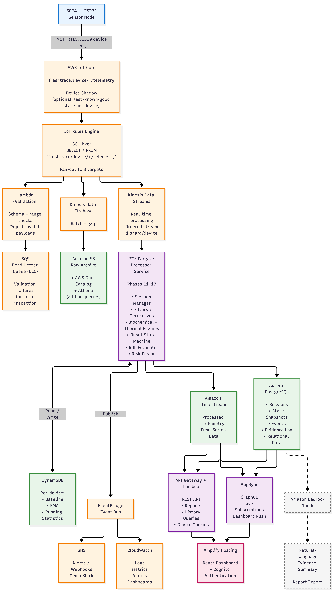
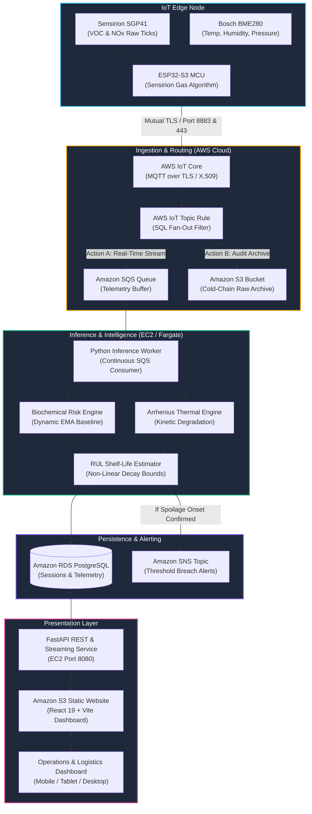

<div align="center">

# 🌿 FreshTrace
### **Real-Time Biochemical Food Spoilage Intelligence & Cold-Chain Predictive Platform**

[](https://www.wemakedevs.org/aws/first-commit/projects)
[](https://www.wemakedevs.org/aws/first-commit/projects)
[](https://www.wemakedevs.org/aws/first-commit/projects)

<br/>

[](http://freshtrace.s3-website.ap-south-1.amazonaws.com/)
[-FF0000?style=flat-square&logo=youtube&logoColor=white)](https://www.youtube.com/watch?v=2fs2fxV5wJw)
[](https://www.wemakedevs.org/aws/first-commit/projects)
[](#-hardware-engineering--iot-node)
[](#-100-aws-native-cloud-architecture)

<br/>

> **"Transforming perishable supply chains from passive guesswork into scientifically verified, real-time chemical foresight."**

**[Explore Live S3 Dashboard ↗](http://freshtrace.s3-website.ap-south-1.amazonaws.com/)** • **[Watch Video Demo ↗](https://www.youtube.com/watch?v=2fs2fxV5wJw)** • **[Hackathon Listing ↗](https://www.wemakedevs.org/aws/first-commit/projects)** • **[Read Architecture Spec ↗](documentation/aws_native_arch.txt)**

---

</div>

<br/>

## 🎬 Live Video Demonstration & Hardware Walkthrough

Click the player below to watch the complete 3-minute pitch, live hardware testbench demonstration, and AWS cloud telemetry streaming:

<div align="center">
  <table style="border: none; background: transparent; width: 100%; max-width: 900px;">
    <tr>
      <td align="center" style="border: none; padding: 0;">
        <div style="position: relative; display: inline-block; width: 100%;">
          <a href="https://www.youtube.com/watch?v=2fs2fxV5wJw" target="_blank" title="Watch FreshTrace Live Demonstration on YouTube">
            
          </a>
        </div>
        <p align="center" style="margin-top: 10px;">
          <a href="https://www.youtube.com/watch?v=2fs2fxV5wJw" target="_blank">
            
          </a>
          <a href="http://freshtrace.s3-website.ap-south-1.amazonaws.com/" target="_blank">
            
          </a>
        </p>
      </td>
    </tr>
  </table>
</div>

<details>
<summary><b>⏱️ Video Chapters & Demonstration Timestamps</b> (Click to expand)</summary>

* **`0:00`** — The $1 Trillion Global Food Spoilage Crisis & Cold-Chain Blindspots
* **`0:35`** — Hardware Unveiling: ESP32-S3 + Sensirion SGP41 Dual MOx + Bosch BME280
* **`1:15`** — Mutual TLS Ingestion to AWS IoT Core (Dual Port 8883/443 ALPN Resilience)
* **`1:48`** — Dynamic Arrhenius Thermal Kinetics & Exponential Baseline Drift Compensation
* **`2:18`** — Real-Time Remaining Useful Life (RUL) Dynamic Countdown Calculation
* **`2:45`** — Live Dashboard Tour: Glassmorphic Gauges, Velocity Metrics, and Instant Alerts
* **`3:10`** — Scalability, Cold-Chain Auditing, and Commercial Impact

</details>

---

## 🏆 Hackathon Recognition & Honors

FreshTrace was conceived, engineered, deployed, and proven at the **AWS x WeMakeDevs "First Commit" Hackathon (Bharat Builds Tour Kickoff)**:

* **Placement:** 🥈 **Won 2nd Prize / Runner-Up** across all participating tracks.
* **Prize Grant:** Awarded **$1,000 in Amazon Web Services (AWS) Cloud Credits** by technical judges.
* **Scale of Competition:** Singled out as a standout project from **13,667+ registered developers and teams** across India.
* **Official Recognition:** Featured on the official [WeMakeDevs First Commit Showcase](https://www.wemakedevs.org/aws/first-commit/projects).
* **Team:** **Powerpuff Girls** ([@saikoushik](https://github.com/saikoushik), [@tonystark69](https://github.com/tonystark69), [@rakshit__](https://github.com/RakshitChaturvedi), [@jigglesh7](https://github.com/jigglesh7)).

---

## 💡 The Core Problem: The $1 Trillion Food Spoilage Blindspot

Each year, over **1.3 billion metric tons of food**—valued at over **$1 Trillion**—is lost or spoiled globally. A staggering **40% of fresh produce and dairy** deteriorates before reaching consumers due to failures across the cold chain:

1. **Static Expiration Dates are Pure Guesswork**: Printed expiry labels assume an ideal, uninterrupted cold chain that rarely exists in real-world transit.
2. **Cold-Chain "Black Boxes"**: Logistics managers only learn about refrigeration failures after delivery when goods are visibly rotten or rejected at distribution centers.
3. **Destructive or Late Detection**: Traditional chemical testing requires puncturing packages in labs. Visible mold, discoloration, and foul odors appear only in terminal spoilage stages—long after the food has become unsafe.

### 🔬 The Biochemical Reality
Microbial respiration begins releasing **Volatile Organic Compounds (VOCs)** such as ethanol, ethyl acetate, dimethyl disulfide, and volatile nitrogenous gases (**NOx**) **24 to 72 hours before visible decay**. By detecting these subtle volatile molecular markers in real time alongside micro-climatic thermal stress, we can detect spoilage onset before it becomes irreversible.

---

## 🚀 The FreshTrace Solution

**FreshTrace** is an end-to-end, IoT-to-Cloud food intelligence ecosystem that converts food storage containers and refrigerated transit trucks into continuous biological monitoring nodes:

* **IoT Electronic Nose (e-Nose)**: An edge sensing unit driven by the **ESP32-S3** microcontroller, sampling dual micro-hotplate metal-oxide (MOx) gas sensors (**Sensirion SGP41**) dynamically cross-compensated with high-precision temperature, humidity, and barometric data (**Bosch BME280**).
* **100% AWS-Native Stream Processing**: Zero-loss, highly scalable event-driven pipeline consuming edge telemetry via **AWS IoT Core**, buffered through **Amazon SQS**, archived into **Amazon S3**, and processed via high-performance background workers.
* **Dual Mathematical Inference Engine**:
  * **Arrhenius Kinetic Thermal Engine**: Integrates continuous thermal abuse time-temperature curves ($k(T) = A e^{-E_a / RT}$).
  * **Dynamic Biochemical Gas Model**: Features dynamic Exponential Moving Average (EMA) baseline drift tracking to eliminate false positives from ambient shifts.
* **Remaining Useful Life (RUL) Countdown**: Continuously computes perishable shelf life with dynamic $\pm 15\%$ confidence bounds and degradation velocity (ticks/second).
* **Audit-Grade Evidence Ledger**: Full historical telemetry and spoilage breach alerts logged in **Amazon RDS (PostgreSQL)** with instant multi-channel alerts via **Amazon SNS**.
* **Real-Time Glassmorphic Dashboard**: Ultra-responsive single-page app built with **React 19 + Vite**, hosted on **Amazon S3 Website Hosting**, offering live telemetry gauges, historical trend curves, and spoilage risk analytics.

---

## ☁️ 100% AWS-Native Cloud Architecture

The FreshTrace backend leverages AWS managed services for high availability, low latency, and zero data loss:

<div align="center">
  
</div>

<br/>

### Data Pipeline & Event Flow



### AWS Services Matrix & Architectural Purpose

| AWS Service | Production Role in FreshTrace | Why It Was Chosen |
| :--- | :--- | :--- |
| **AWS IoT Core** | Authenticated MQTT message broker with per-device X.509 certificates. | Enterprise-grade TLS encryption, sub-second latency, zero broker maintenance. |
| **IoT Topic Rules** | SQL fan-out filter (`SELECT * FROM 'freshtrace/device/+/telemetry'`). | Declarative zero-code routing directly to SQS and S3 in parallel without compute overhead. |
| **Amazon SQS** | High-throughput FIFO message buffer decoupling ingestion from computation. | Absorbs network traffic bursts and guarantees no sensor payload is lost during compute spikes. |
| **Amazon S3** | Durable, tamper-resistant cold raw telemetry storage and static website hosting. | 99.999999999% durability for regulatory audit compliance and cost-effective static hosting. |
| **Amazon EC2 (t3.small)** | Runs the FastAPI REST server and Python background inference service. | Low-latency stateful stream consumption, continuous model calculations, and persistent connections. |
| **Amazon RDS (PostgreSQL)** | Stores structured sessions, processed time series, event ledgers, and state snapshots. | ACID compliance, relational queries for audit reports, and indexing across device sessions. |
| **Amazon SNS** | Dispatches instant push/SMS/email alerts upon confirmed spoilage triggers. | Instant, reliable alerting to cold-chain managers before entire shipments spoil. |
| **Amazon CloudWatch** | Centralized log ingestion, synthetic monitors, and alarm infrastructure. | Provides production visibility and observability across the entire IoT-to-cloud pipeline. |

---

## ⚡ Hardware Engineering & IoT Node

The FreshTrace hardware node is an autonomous Electronic Nose (e-Nose) engineered for low power, high chemical sensitivity, and industrial robustness:

<div align="center">
  <table style="border: none; background: transparent; width: 100%;">
    <tr>
      <td width="33%" align="center">
        <b>ESP32-S3 Microcontroller</b><br/>
        <sub>Dual-core Xtensa LX7 @ 240 MHz<br/>512KB SRAM, 2.4 GHz Wi-Fi<br/>Hardware Cryptographic Engine</sub>
      </td>
      <td width="33%" align="center">
        <b>Sensirion SGP41 Gas Sensor</b><br/>
        <sub>Dual MOx Micro-hotplates<br/>VOC Index (1–500) & Raw Ticks<br/>NOx Index (1–500) & Raw Ticks</sub>
      </td>
      <td width="33%" align="center">
        <b>Bosch BME280 Sensor</b><br/>
        <sub>Digital Humidity (±3% RH)<br/>Temperature (±0.5°C)<br/>Barometric Pressure (±1 hPa)</sub>
      </td>
    </tr>
  </table>
</div>

### Firmware Innovations
1. **Dynamic Environmental Gas Compensation**: The Sensirion SGP41's metal-oxide sensor hotplates undergo resistance shifts depending on ambient humidity and temperature. The ESP32 firmware samples the Bosch BME280 at 1 Hz and directly injects instantaneous $T$ and $RH$ values into Sensirion's compensation algorithms before publishing.
2. **Dual-Port AWS MQTT Resilience**: In refrigerated transport and mobile hotspots, standard MQTT port `8883` is frequently firewalled. The firmware attempts TLS on port `8883`; upon timeout, it automatically falls back to port `443` using AWS ALPN (`x-amzn-mqtt-ca`).
3. **Microsecond NTP Time Sync**: Synchronizes with public NTP servers before the TLS handshake to validate AWS X.509 certificate expiration dates accurately even across battery reboots.
4. **Structured JSON Telemetry (1 Hz)**:
   ```json
   {
     "device_id": "FreshTrace-Node-01",
     "food_type": "tomato",
     "temperature_c": 24.85,
     "humidity_pct": 52.30,
     "pressure_hpa": 1012.45,
     "voc_raw": 28450,
     "nox_raw": 18200,
     "voc_index": 115,
     "nox_index": 1,
     "wifi_rssi": -62
   }
   ```

---

## 🧮 Mathematical & Inference Models

FreshTrace moves beyond naive single-threshold alarms by fusing continuous biochemical gas signals with kinetic thermodynamics:

### 1. Dynamic Baseline Compensation (Microbial Drift Tracking)
To eliminate false alarms caused by variable ambient environments (e.g., opening a shipping crate), FreshTrace computes an Exponential Moving Average (EMA) baseline of clean ambient conditions:
$$\text{VOC}_{\text{base}}(t) = \alpha \cdot \text{VOC}_{\text{raw}}(t) + (1 - \alpha) \cdot \text{VOC}_{\text{base}}(t - 1) \quad (\alpha = 0.05)$$

The true biological decomposition signal is derived from the net delta above dynamic baseline:
$$\Delta \text{VOC} = \max\left(0, \text{VOC}_{\text{raw}} - \text{VOC}_{\text{base}}\right)$$

### 2. Sigmoidal Biochemical Spoilage Risk
Biochemical spoilage follows an exponential microbial growth curve. FreshTrace normalizes this using a parameterized sigmoidal activation function:
$$\text{Risk}_{\text{bio}} = \frac{1}{1 + e^{-k \cdot (\Delta \text{VOC} - \theta_{\text{mid}})}}$$
*Where $\theta_{\text{mid}}$ is calibrated per produce type (e.g., Tomato, Paneer, Mango).*

### 3. Arrhenius Kinetic Thermal Exposure
Thermal abuse accelerates enzymatic reactions according to the Arrhenius rate equation. Cumulative thermal debt is calculated as:
$$k(T) = A \cdot \exp\left(-\frac{E_a}{R \cdot (T + 273.15)}\right)$$
$$\text{Abuse}_{\text{thermal}} = \sum \max(0, T(t) - T_{\text{opt}}) \cdot \Delta t \cdot k(T)$$

### 4. Remaining Useful Life (RUL) Estimation
Dynamic shelf life countdown combines instantaneous multi-factor risk with the rate of degradation (velocity):
$$\text{RUL}_{\text{hours}} = \max\left(0, \text{RUL}_{\text{initial}} \cdot \frac{1 - \text{Risk}_{\text{composite}}}{1 + 10 \cdot |\text{Velocity}_{\text{degradation}}|}\right)$$
$$\text{Confidence Interval} = \left[0.85 \cdot \text{RUL}, \; 1.15 \cdot \text{RUL}\right]$$

---

## 💻 Tech Stack & Engineering Directory

### Repository Structure

```
freshtrace/
├── FreshTrace_Sensor/              # ESP32-S3 IoT Node Firmware & AWS MQTT Publisher
│   ├── FreshTrace_Sensor.ino       # Dual I2C driver, Gas Algorithm & AWS TLS publisher
│   ├── secrets.example.h           # Template for Wi-Fi & AWS X.509 credentials
│   └── README.md                   # Pinout, Arduino setup & flashing guide
│
├── src/axios/                      # Core Python 3.12 Backend & Inference Engine
│   ├── inference_service.py        # Real-time SQS worker, threshold alerts, DB persistence
│   ├── config.py                   # Pydantic environment configuration
│   ├── api/                        # FastAPI REST endpoints & live SSE telemetry stream
│   ├── biochemical/                # VOC/NOx baseline calibrator & microbial risk models
│   ├── thermal/                    # Arrhenius kinetic thermal abuse integration
│   ├── rul/                        # Non-linear RUL estimator & confidence calculator
│   ├── processing/                 # Signal cleaning, Kalman/EMA filters & anomaly rejection
│   ├── ingestion/                  # Edge payload validator & normalization
│   └── persistence/                # SQLAlchemy ORM, RDS PostgreSQL schemas & SQLite fallback
│
├── frontend/                       # FreshTrace React 19 + Vite Dashboard
│   ├── src/
│   │   ├── App.jsx                 # Glassmorphic dashboard, live gauges, RUL clock
│   │   ├── App.css                 # Responsive styles, pill tabs, velocity cards
│   │   └── index.css               # Global tokens, Outfit typography, resets
│   ├── public/                     # High-definition produce wallpapers & SVG assets
│   ├── index.html                  # HTML5 entry with SEO meta tags
│   └── package.json                # React 19, Lucide Icons, Vite 8
│
├── scripts/                        # Automated AWS Cloud Deployment & CI/CD Tooling
│   ├── deploy_aws_backend.py       # Provisions EC2, installs systemd services, bundles code
│   ├── deploy_aws_frontend.py      # Builds React bundle & deploys to S3 Static Website
│   ├── deploy_aws_infra.py         # Automates SQS, SNS, S3 raw bucket, and IoT Rules
│   ├── verify_full_cloud_deployment.py # Automated E2E verification across all AWS services
│   └── replay_session.py           # Offline batch telemetry replayer for model benchmarking
│
├── documentation/                  # System blueprints, PDFs & architecture specifications
│   ├── aws_architecture.png       # High-resolution AWS native architecture diagram
│   └── aws_native_arch.txt         # Detailed design justification and component mapping
│
├── pyproject.toml                  # Python packaging & tool configurations (Ruff, Pytest)
├── requirements.txt                # Production backend dependencies
└── codebase.mf                     # Exhaustive codebase manifest and verification report
```

---

## 🛠️ Quickstart & Local Reproduction Guide

You can run FreshTrace locally using SQLite and simulated telemetry, or connect to your own AWS Cloud environment.

### 1. Prerequisites
* **Python**: 3.9+ (Python 3.12 recommended)
* **Node.js**: 18+ & npm
* **Hardware (Optional)**: ESP32-S3 + Sensirion SGP41 + Bosch BME280

### 2. Backend & Inference Engine Setup
```bash
# Clone the repository
git clone https://github.com/RakshitChaturvedi/freshtrace.git
cd freshtrace

# Create and activate virtual environment
python -m venv venv
source venv/bin/activate       # On Windows: .\venv\Scripts\activate

# Install dependencies
pip install -r requirements.txt
pip install -e .

# Configure environment variables
cp .env.example .env

# Run FastAPI REST Service (Port 8080)
python -m uvicorn axios.api.routes:app --app-dir src --host 0.0.0.0 --port 8080 --reload
```

In a separate terminal, launch the background SQS / local inference worker:
```bash
python -m axios.inference_service
```

### 3. Frontend Dashboard Setup
```bash
cd frontend

# Install npm dependencies
npm install

# Start local development server with Vite
npm run dev -- --port 5180
```
Open [http://localhost:5180](http://localhost:5180) in your browser.

### 4. Flashing the IoT Sensor Node
1. Open `FreshTrace_Sensor/FreshTrace_Sensor.ino` in the Arduino IDE.
2. Install required libraries: `PubSubClient`, `ArduinoJson`, `Adafruit BME280`, `Sensirion I2C SGP41`, `Sensirion Gas Index Algorithm`.
3. Copy `secrets.example.h` to `secrets.h` and populate your Wi-Fi SSID, AWS IoT endpoint, and X.509 certificates.
4. Select board **ESP32-S3 Dev Module** and flash via USB.

---

## 👥 The Team: Powerpuff Girls

FreshTrace was developed with passion by **Team Powerpuff Girls**:

| Developer | Role & Contributions | GitHub / Socials |
| :--- | :--- | :--- |
| **Sai Koushik Pallapolu** | Cloud Architecture, AWS IoT Core, SQS Pipeline & S3 Hosting | [@saikoushik](https://github.com/saikoushik) |
| **Tony Stark (Shiva)** | Hardware Firmware (ESP32-S3, SGP41, BME280) & Edge mTLS | [@tonystark69](https://github.com/tonystark69) |
| **Rakshit Chaturvedi** | Biochemical & Arrhenius ML Engines, RUL Algorithms & Backend API | [@rakshit__](https://github.com/RakshitChaturvedi) |
| **JiggleSh7** | Frontend UI/UX (React 19, Vite, Glassmorphism) & Data Visualizations | [@jigglesh7](https://github.com/jigglesh7) |

Special thanks to **Amazon Web Services (AWS)** and **WeMakeDevs** for organizing the **Bharat Builds Tour: First Commit Hackathon**.

---

<div align="center">
  <sub>FreshTrace • Developed for AWS First Commit Hackathon • Open Source under Apache 2.0</sub>
</div>
